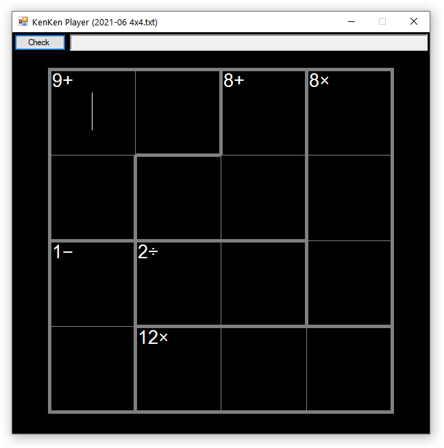
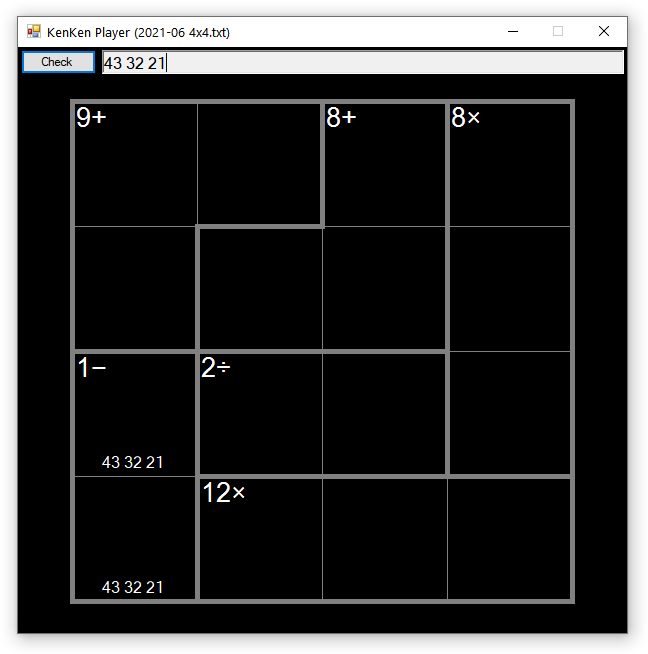
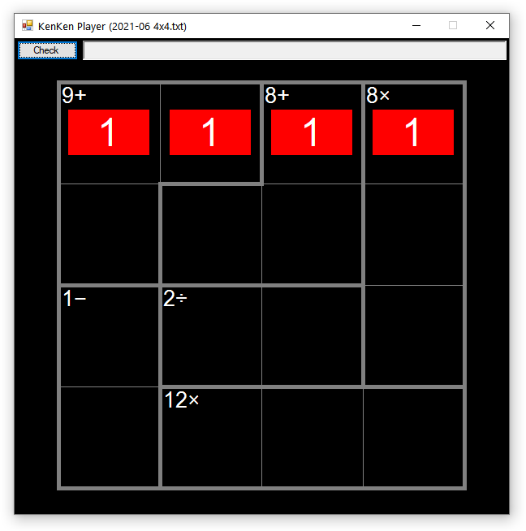

# KenKenPlayer



This is a Forms program that lets you play KenKen puzzles and checks your work. It can't solve puzzles on its own, though.

It supports common sizes of puzzles, like 4x4, 5x5, and 6x6. It may work with larger puzzles, but those are the puzzle sizes that I've tested it with.

No-op puzzles are not supported. The puzzles must have operations for each cage, unless a cage only has a single cell.

You can take notes using the text box at the top of the window and they'll be displayed at the bottom of the cell that's currently in focus. You can use bold, italics, underlines, and strikethroughs in your notes to organize them, like to strike out eliminated candidate numbers. See the keyboard shortcuts section to learn how to apply the styles.



Clicking the `Check` button will check the puzzle. It first checks the rows and columns to make sure that the appropriate numbers are present in each, and then it checks each cage to see if the calculated result matches the expected one. If anything is amiss, the cells in question will be highlighted in red. Otherwise, if everything checks out, the cells will all be highlighted green and your puzzle time will appear in the title bar.



You can adjust the colors, fonts, dimensions, and other aspects of how the puzzles are rendered at the top of [`KenKenPlayer.cs`](KenKenPlayer/KenKenPlayer.cs).

## Puzzle Text File

You'll need to manually convert your puzzles into specially formatted text files to load them into the KenKen Player. I tried to keep the process as painless as possible so that it can be done quickly and you can get to playing your puzzles.

This is what one such text file looks like. This is the June 2021 4x4 puzzle from [the official KenKen site](http://www.kenkenpuzzle.com/)

```text
0,0,1,2
0,1,1,2
3,4,4,2
3,5,5,5
0: 9+
1: 8+
2: 8x
3: 1-
4: 2/
5: 12x
```

The first 4 lines tell the program about the cage assignments, or which cells belong to which cage. There's a line for each row, and the cell numbers are separated by commas. You can use hex numbers if you want. The program also uses this information to determine the dimensions of the puzzle.

You can see how the cage assignments line up with the cages in the screenshot at the top of this file.

The lines after the cage assignments contain the cage entries, which map operations and results to each cage. The lines should start with the cage index, a colon, and a space. Then, you need the result of that cage and a character representing the operation.

Here are the supported characters for each operation. They should be self-explanatory.

|Operation|Characters|
|:--|:--|
|Addition|`+`|
|Subtraction|`-`|
|Multiplication|`x` or `*`|
|Division|`/`|
|None|`_`|

For no-op cages, you can also just drop the operation character and end the line with the result, like so:

```text
3: 2
```

Once you've converted your puzzles to text files, drag them into the KenKen Player window to load them up and play. If there's a parsing error, the program will let you know.

## Keyboard Shortcuts

Once you've loaded a puzzle by dragging a text file into the program, you can play it using the keyboard alone.

`Tab` moves the focus from cell to cell, and also to the `Check` button and notes text box at the top of the window.

`Enter` is the same as pressing the `Check` button, allowing you to check your work from anywhere in the puzzle.

`Ctrl-N` moves between the currently focused cell and the notes text box, and vice versa.

`Ctrl-B` in the notes text box toggles the bold style on the currently selected text.

`Ctrl-I` in the notes text box toggles the italics style on the currently selected text.

`Ctrl-U` in the notes text box toggles the underline style on the currently selected text.

`Ctrl-K` in the notes text box toggles the strikethrough style on the currently selected text.
